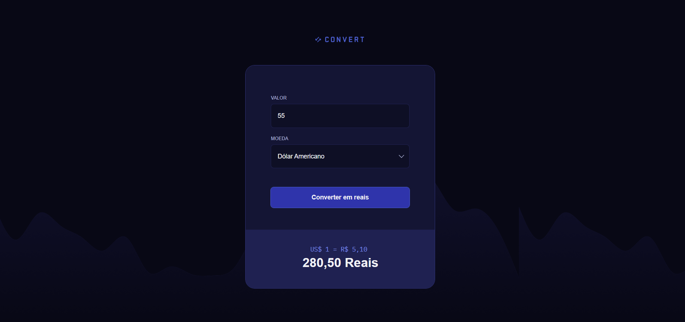

# Conversor de Moedas

Projeto praticado com os estudos da Rocketseat.

Um conversor de moedas desenvolvido com **HTML, CSS e JavaScript**, capaz de converter valores em **Real Brasileiro (BRL)** a partir das moedas **Dólar Americano (USD)**, **Euro (EUR)** e **Libra Esterlina (GBP)**.

O projeto foi desenvolvido com o objetivo de praticar conceitos fundamentais de JavaScript, manipulação do DOM e tratamento de eventos.

---

## Preview

---

## Funcionalidades

- Conversão de Dólar (USD) para Real (BRL)
- Conversão de Euro (EUR) para Real (BRL)
- Conversão de Libra Esterlina (GBP) para Real (BRL)
- Validação para aceitar apenas números no campo de entrada
- Exibição da cotação utilizada
- Resultado formatado no padrão monetário brasileiro
- Tratamento de erros durante a conversão

---

## Tecnologias utilizadas

- HTML5
- CSS3
- JavaScript (ES6)

---

## Conceitos praticados

Durante o desenvolvimento deste projeto foram aplicados diversos conceitos importantes de JavaScript, como:

- Variáveis e Constantes
- Manipulação do DOM
- Eventos (`input` e `submit`)
- Funções
- Expressões Regulares (Regex)
- Estruturas Condicionais (`switch`)
- Tratamento de Erros (`try...catch`)
- Manipulação de Classes CSS
- Formatação de Moedas com `toLocaleString()`
- Validação de Dados
- Template Strings

---

## Como funciona

1. O usuário informa o valor que deseja converter.
2. Seleciona a moeda de origem.
3. O sistema identifica a cotação correspondente.
4. O valor é convertido automaticamente para Real Brasileiro (BRL).
5. O resultado é exibido formatado utilizando o padrão brasileiro de moeda.

---
## Aprendizados

Este projeto foi importante para reforçar conhecimentos sobre:

- Manipulação de elementos HTML através do DOM
- Captura e tratamento de eventos
- Organização de código utilizando funções
- Validação de entradas do usuário
- Boas práticas na formatação de dados
- Estruturação de aplicações JavaScript sem frameworks

---
